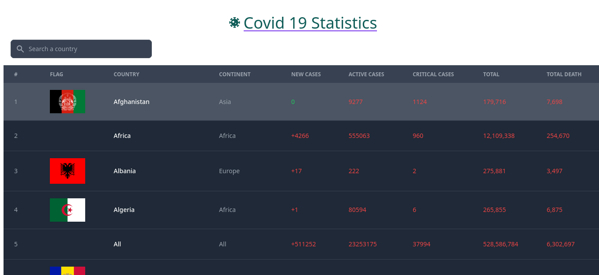
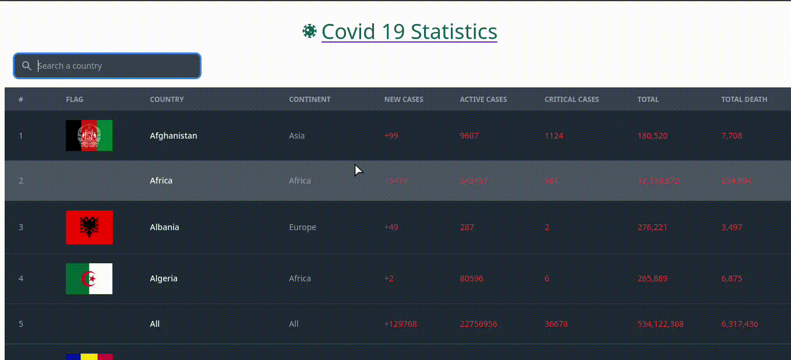

# vue-covid19-statistics

## Project setup

### Image


### demostration


### Env variable configuration
```bash
VUE_APP_URL=your_url
VUE_APP_API_KEY=your_api_key
VUE_APP_API_HOST=your_api_host
```
### Running on the browser
```sh
npm install
npm run serve
```

> PD: not all flags are complete